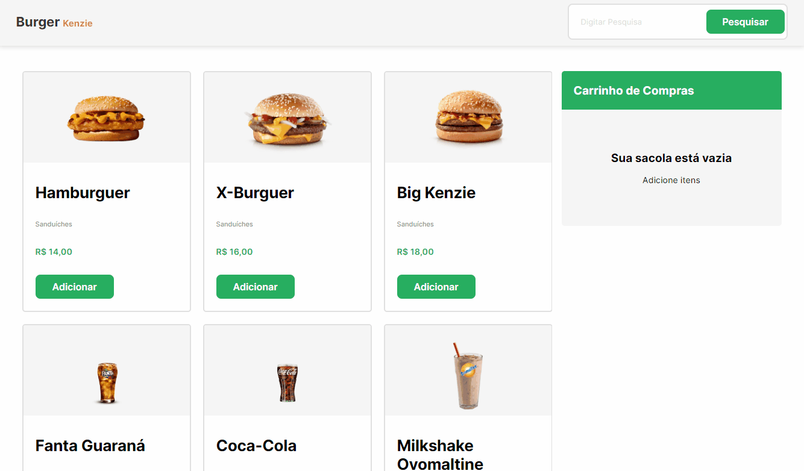

<h1 > Kenzie Burger </h1>

<p>Kenzie Burger is a web application that simulates a burger delivery app. Users can add and remove items to their cart and search for items by name.</p>

<h2> Features: </h2>
<ul>
    <li>Adding and Removing Items: To add an item to your cart, click the "Add to Cart" button next to the item. To remove an item from your cart, click the "Remove" button next to the item in your cart. </li>
    <li>Searching for Items: To search for items by name, enter a search term in the search bar at the top of the page. The items displayed on the page will update to show only items that match the search term.</li>
</ul>

<h2> Technologies: </h2>
<ul>
    <li>ReactJS</li>
    <li>Styled Components</li>
    <li>Axios</li>
</ul>

<p align="center">

</p>

<h1> Testing this app </h1>

```bash
    # Clone repository
    $ git clone https://github.com/yagoramires/kenzie-burger.git
    # Access the repository folder
    $ cd kenzie-burger
    # Install the dependencies
    $ yarn
    # Run the application in development mode
    $ yarn start
    # The server will start on port:3000 - access http://localhost:3000/
```

<h1> Author </h1>

<div align="center" >
    <p>
        
    </p>
    <p>
        <a
            href="https://www.linkedin.com/in/yagoramires/"
            target="_blank"
            >
            
        </a>
    </p>
    <p>
        <a href="https://github.com/yagoramires" ><b>Yago Ramires</b> 🚀</a>
    </p>
</div>
